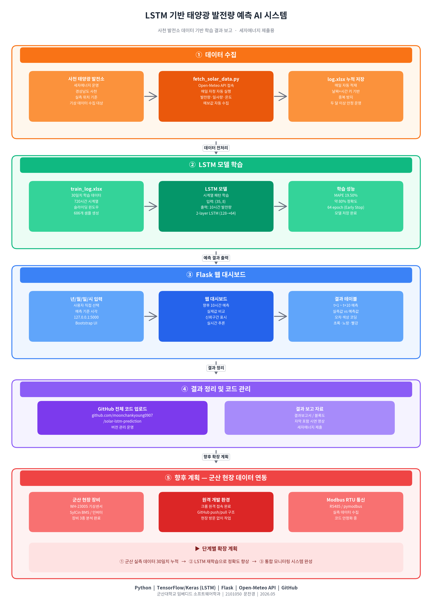
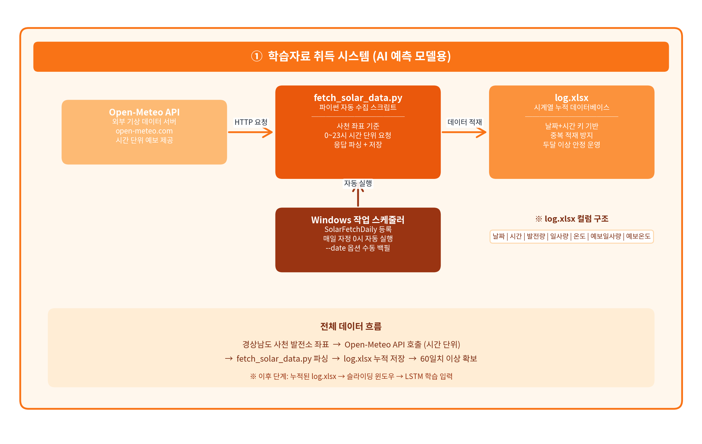
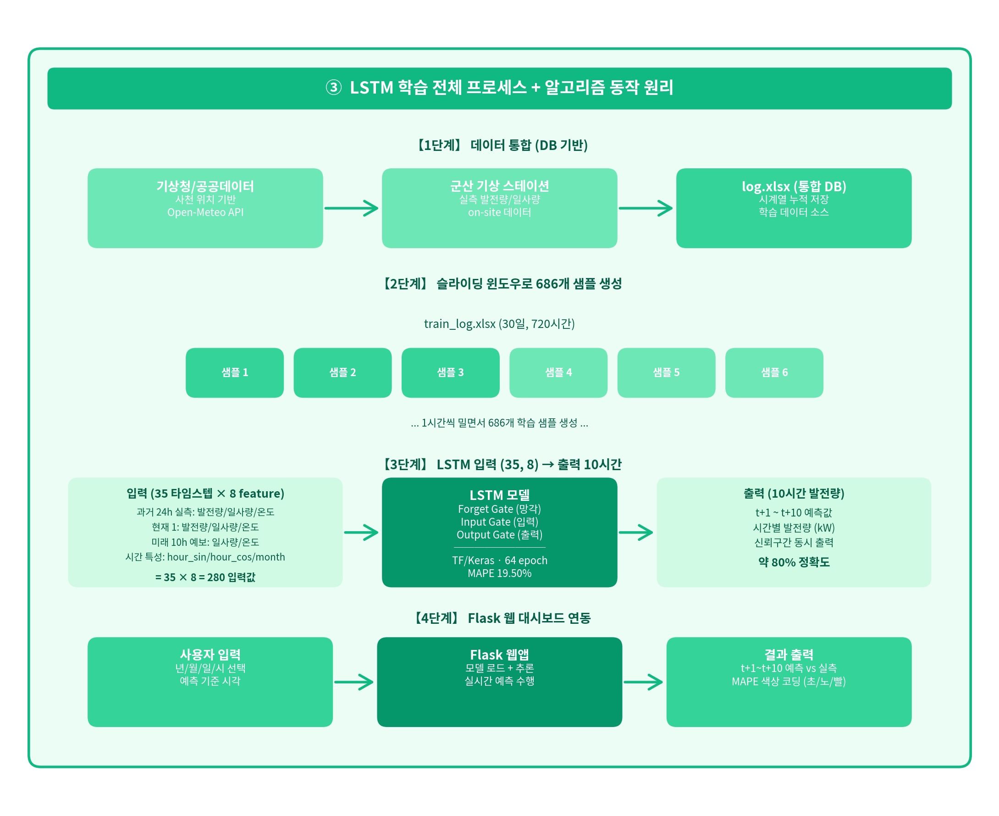
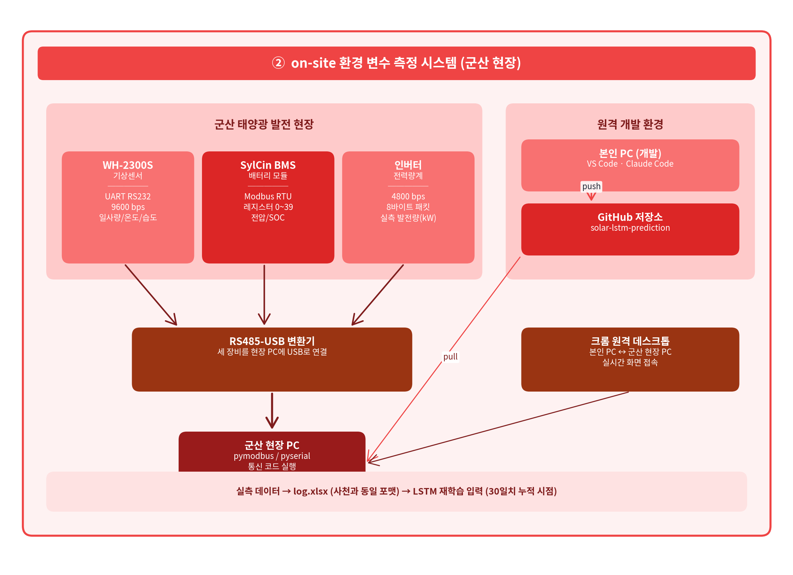

# LSTM 태양광 발전량 10시간 예측 시스템

> **세자에너지 사천 발전소** — 2-Layer LSTM 기반 향후 10시간 태양광 발전량 예측  
> Validation MAPE: **19.50%** | Python 3.11 | TensorFlow 2.15



---

## 목차

1. [프로젝트 개요](#1-프로젝트-개요)
2. [환경 설정](#2-환경-설정)
3. [전체 시스템 흐름](#3-전체-시스템-흐름)
4. [데이터 수집 파이프라인](#4-데이터-수집-파이프라인)
5. [LSTM 모델 학습](#5-lstm-모델-학습)
6. [예측 실행](#6-예측-실행)
7. [Flask 웹 대시보드](#7-flask-웹-대시보드)
8. [LSTM 알고리즘 동작 원리](#8-lstm-알고리즘-동작-원리)
9. [향후 확장 — 군산 현장 연동](#9-향후-확장--군산-현장-연동)
10. [디렉토리 구조](#10-디렉토리-구조)
11. [트러블슈팅](#11-트러블슈팅)
12. [작성자 정보](#12-작성자-정보)

---

## 1. 프로젝트 개요

경남 **사천시(LAT 34.9418°N, LON 128.0635°E)** 소재 100 kW급 태양광 발전소의 시간별 발전량을 현재 시점 기준으로 **이후 10시간** 동안 예측합니다.

| 항목 | 값 |
|------|-----|
| 발전소 위치 | 경남 사천시 (세자에너지) |
| 설비 용량 | 1.5 MW급 (1500 kW급) |
| 예측 구간 | 현재 시각 기준 t+1 ~ t+10 시간 |
| 검증 MAPE | **19.50%** |
| 모델 | 2-Layer LSTM (128 → 64) + Dense (32 → 16 → 10) |
| 총 파라미터 | 122,330 개 |
| 학습 데이터 | train_log.xlsx (30일, 720시간) |

---

## 2. 환경 설정

### 사전 요구사항

- **Python 3.11** (3.12 미지원 — [트러블슈팅 참조](#11-트러블슈팅))
- Git

### 설치 절차

```bash
# 1. 저장소 클론
git clone https://github.com/moonchankyoung0907/solar-lstm-prediction.git
cd solar-lstm-prediction

# 2. 가상환경 생성 및 활성화
python -m venv .venv

# Windows
.venv\Scripts\activate

# macOS / Linux
source .venv/bin/activate

# 3. 의존성 설치 (pyproject.toml 기준)
pip install -e .
```

### pyproject.toml 주요 의존성

```toml
[project]
name = "2026-seja-capstone-project-lstm"
requires-python = ">=3.11"
dependencies = [
    "tensorflow>=2.15",
    "numpy>=1.24",
    "pandas>=2.0",
    "scipy>=1.11",
    "scikit-learn>=1.3",
    "openpyxl>=3.1.5",
    "flask>=3.0",
    "apscheduler>=3.10",
    "joblib>=1.3",
    "pyserial>=3.5",
    "requests",
]
```

---

## 3. 전체 시스템 흐름

```
[Open-Meteo API]          [인버터 CSV]
      │                        │
      └──────────┬─────────────┘
                 ▼
        fetch_solar_data.py
        (매일 00:00 자동 실행)
                 │
      ┌──────────┴──────────┐
      ▼                     ▼
  log.xlsx             train_log.xlsx
  (12컬럼)              (7컬럼, 학습용)
                             │
                             ▼
                    solar_lstm_xlsx/train.py
                    ┌──────────────────────┐
                    │ data_loader.py       │
                    │ preprocessor.py      │
                    │ feature_builder.py   │
                    │ scaler.py            │
                    │ lstm_model.py        │
                    └──────────────────────┘
                             │
                    solar_lstm_xlsx/models/
                    ├── model.keras
                    └── scaler.pkl
                             │
              ┌──────────────┴──────────────┐
              ▼                             ▼
   solar_lstm_xlsx/predict.py        flask_app/app.py
   (CLI 단일 예측)                   (웹 대시보드 127.0.0.1:5000)
```

---

## 4. 데이터 수집 파이프라인



### fetch_solar_data.py

루트 디렉터리의 `fetch_solar_data.py`가 Open-Meteo API를 통해 하루치(24시간) 기상 데이터를 수집하고, `log.xlsx` 및 `train_log.xlsx`에 누적 저장합니다.

#### 즉시 실행 (어제 날짜 수집)

```bash
python fetch_solar_data.py --run-now
```

#### 특정 날짜 수집

```bash
python fetch_solar_data.py --run-now --date 2026-03-14
```

#### 스케줄러 모드 (매일 자정 자동 실행)

```bash
python fetch_solar_data.py
```

내부적으로 `BlockingScheduler(timezone="Asia/Seoul")`를 사용하여 매일 00:00에 `daily_job()`을 실행합니다.

#### Windows 작업 스케줄러 등록 (권장)

APScheduler 대신 Windows 작업 스케줄러를 사용할 경우:

1. **작업 스케줄러** → **작업 만들기**
2. **트리거**: 매일 00:05 (API 반영 여유)
3. **동작**: 프로그램/스크립트
   ```
   C:\경로\.venv\Scripts\python.exe
   인수: C:\경로\fetch_solar_data.py --run-now
   시작 위치: C:\경로\
   ```
4. **조건**: 컴퓨터가 켜져 있을 때만 실행 체크 해제

#### 저장 파일 컬럼 구조

**log.xlsx** (12컬럼 — 실측·예측 비교용)

| 컬럼 | 설명 |
|------|------|
| 날짜 | YYYY-MM-DD |
| 시간 | 0시 ~ 23시 |
| 실제 발전량(kW) | 인버터 CSV 또는 물리 모델 추정값 |
| 실제 누적발전량(kWh) | 당일 누적 |
| 실제 일사량(W/㎡) | Open-Meteo Archive API |
| 실제 기온(℃) | Open-Meteo Archive API |
| 실제 풍속(㎧) | Open-Meteo Archive API |
| 예측 발전량(kW) | 예측 일사량 기반 물리 모델 |
| 예측 누적발전량(kWh) | 당일 누적 |
| 예측 일사량(W/㎡) | Open-Meteo Forecast API |
| 예측 기온(℃) | Open-Meteo Forecast API |
| 예측 풍속(㎧) | Open-Meteo Forecast API |

**train_log.xlsx** (7컬럼 — LSTM 학습 입력)

| 컬럼 | 설명 |
|------|------|
| 날짜 | YYYY-MM-DD |
| 시간 | 0시 ~ 23시 |
| 발전량(kW) | 실측 발전량 |
| 일사량(W/㎡) | 실측 일사량 |
| 기온(℃) | 실측 기온 |
| 예측 일사량(W/㎡) | 예보 일사량 |
| 예측 기온(℃) | 예보 기온 |

#### 물리 모델 발전량 추정식

인버터 CSV가 없을 때 `estimate_power()`가 자동으로 추정합니다.

```
temp_module   = temp_air + (NOCT - 20) / 800 × irradiance
temp_derating = 1.0 - 0.004 × max(0, temp_module - 25)
P             = 100 kW × (irradiance / 1000) × 0.96 × 0.85 × temp_derating
```

---

## 5. LSTM 모델 학습



### 5-1. 학습 실행

```bash
# 프로젝트 루트에서 모듈로 실행 (권장)
python -m solar_lstm_xlsx.train

# 또는 직접 실행
python solar_lstm_xlsx/train.py
```

학습이 완료되면 다음 파일이 자동 저장됩니다.

```
solar_lstm_xlsx/models/
├── model.keras      ← 최적 가중치 자동 저장 (ModelCheckpoint)
└── scaler.pkl       ← MinMaxScaler (X용·y용 각 1개, joblib 직렬화)
```

### 5-2. 학습 데이터

`train_log.xlsx` 파일에서 `load_xlsx()`로 로드합니다.

- **기간**: 30일, **720시간** (시간별 1행)
- **경로**: `config.py`의 `DATA_PATH = BASE_DIR.parent / "train_log.xlsx"`

`load_xlsx()` 내부에서 모듈 온도를 NOCT 공식으로 계산합니다.

```python
df["temp_module"] = df["temp_air"] + (NOCT - 20) / 800.0 * df["irradiance"]
# NOCT = 45  (공칭 동작 셀 온도)
```

### 5-3. 전처리 파이프라인 (preprocessor.py)

`preprocess(df)` 함수가 세 단계를 순서대로 적용합니다.

```python
df = remove_outliers_iqr(df, NUMERIC_COLS)   # IQR 이상치 → NaN
df = interpolate_missing(df)                  # 선형 보간 + ffill/bfill
df = mask_nighttime(df)                       # 21시 ~ 06시: irradiance·power = 0
```

처리 대상 컬럼: `irradiance, temp_module, temp_air, power_actual, irr_forecast, temp_forecast`

### 5-4. 입력 텐서 구조 (35, 8)

`build_sliding_windows(df)` 함수가 슬라이딩 윈도우 방식으로 `(N, 35, 8)` 텐서를 생성합니다.

```
시퀀스 축 (SEQ_LEN = 35):
┌──────────────────────────────────────────────┐
│ index  0 ~ 23  : 과거 24시간  (PAST_STEPS)   │
│ index 24       : 현재 시점   (현재 1시간)     │
│ index 25 ~ 34  : 미래 10시간 (FUTURE_STEPS)  │
└──────────────────────────────────────────────┘

피처 축 (NUM_FEATURES = 8):
┌─────┬────────────────────────────────────────────────────┐
│  0  │ irradiance      실측 일사량 (W/㎡)                  │
│  1  │ temp_module     모듈 온도 (℃, NOCT 공식)            │
│  2  │ power_actual    실측 발전량 (kW)                    │
│  3  │ irr_forecast    예보 일사량 — 미래 10h에만 유효      │
│  4  │ temp_forecast   예보 기온   — 미래 10h에만 유효      │
│  5  │ hour_sin        sin(2π × hour / 24)                │
│  6  │ hour_cos        cos(2π × hour / 24)                │
│  7  │ month_norm      month / 12.0                       │
└─────┴────────────────────────────────────────────────────┘
```

각 구간의 피처 할당:

| 구간 | index | irr | temp_module | power | irr_fore | temp_fore | time×3 |
|------|-------|:---:|:-----------:|:-----:|:--------:|:---------:|:------:|
| 과거 24h | 0~23 | ✓ | ✓ | ✓ | — | — | ✓ |
| 현재 1h | 24 | ✓ | ✓ | ✓ | — | — | ✓ |
| 미래 10h | 25~34 | — | — | — | ✓ | ✓ | ✓ |

> 미래 구간에서 실측값(irr, power)은 알 수 없으므로 0으로 패딩되며, 예보값과 시간 피처만 사용됩니다.

**타겟**: `y = (N, 10)` — 미래 10시간의 `power_actual` 실측 발전량

### 5-5. 스케일링 (scaler.py)

`SolarScaler` 클래스가 `sklearn.preprocessing.MinMaxScaler`를 X(입력)와 y(타겟) 각각 독립적으로 적용합니다.

```python
scaler = SolarScaler()
scaler.fit(X, y)
X_scaled = scaler.transform_x(X)   # (N, 35, 8) → reshape(-1, 8) → fit → reshape back
y_scaled = scaler.transform_y(y)   # (N, 10)
```

저장: `scaler.save()` → `solar_lstm_xlsx/models/scaler.pkl` (joblib)

### 5-6. 학습/검증 분할

시계열 순서를 보존하는 **앞-뒤 분할** (셔플 없음):

```python
TRAIN_RATIO = 0.8
split   = int(len(X_scaled) * TRAIN_RATIO)
X_train = X_scaled[:split];  X_val = X_scaled[split:]
y_train = y_scaled[:split];  y_val = y_scaled[split:]
```

### 5-7. 모델 구조 (lstm_model.py)

```python
model = keras.Sequential([
    layers.Input(shape=(35, 8)),
    layers.LSTM(128, return_sequences=True),
    layers.Dropout(0.2),
    layers.LSTM(64, return_sequences=False),
    layers.Dropout(0.2),
    layers.Dense(32, activation="relu"),
    layers.Dense(16, activation="relu"),
    layers.Dense(10, activation="linear"),   # 미래 10시간 발전량 동시 예측
])

model.compile(
    optimizer=keras.optimizers.Adam(learning_rate=0.001),
    loss="mse",
    metrics=["mae"],
)
```

| 레이어 | 출력 Shape | 파라미터 수 |
|--------|-----------|:-----------:|
| Input | (None, 35, 8) | 0 |
| LSTM(128) | (None, 35, 128) | 70,144 |
| Dropout(0.2) | (None, 35, 128) | 0 |
| LSTM(64) | (None, 64) | 49,408 |
| Dropout(0.2) | (None, 64) | 0 |
| Dense(32, relu) | (None, 32) | 2,080 |
| Dense(16, relu) | (None, 16) | 528 |
| Dense(10, linear) | (None, 10) | 170 |
| **합계** | — | **122,330** |

### 5-8. 학습 콜백 및 하이퍼파라미터

```python
callbacks = [
    EarlyStopping(monitor="val_loss", patience=10, restore_best_weights=True, verbose=1),
    ModelCheckpoint(filepath="solar_lstm_xlsx/models/model.keras",
                    monitor="val_loss", save_best_only=True, verbose=1),
    ReduceLROnPlateau(monitor="val_loss", factor=0.5, patience=5, min_lr=1e-6, verbose=1),
]

history = model.fit(
    X_train, y_train,
    validation_data=(X_val, y_val),
    epochs=100,
    batch_size=32,
    callbacks=callbacks,
    verbose=1,
)
```

| 하이퍼파라미터 | 값 |
|---------------|:---:|
| EPOCHS | 100 (Early Stopping → 실제 64 epoch 조기 종료) |
| BATCH_SIZE | 32 |
| LEARNING_RATE | 0.001 |
| EARLY_STOP_PATIENCE | 10 |
| DROPOUT_RATE | 0.2 |
| TRAIN_RATIO | 0.8 |

### 5-9. MAPE 계산

`compute_mape()` 함수는 실측값이 0인 야간 구간을 제외하고 계산합니다.

```python
def compute_mape(actual, predicted):
    actual    = np.asarray(actual,    dtype=np.float64).flatten()
    predicted = np.asarray(predicted, dtype=np.float64).flatten()
    mask = actual != 0
    if mask.sum() == 0:
        return 0.0
    return float(np.mean(np.abs((actual[mask] - predicted[mask]) / actual[mask])) * 100)
```

**최종 Validation MAPE: 19.50%**

---

## 6. 예측 실행

### CLI 예측 (predict.py)

```bash
# 기본: 데이터 마지막 시점 기준 예측
python -m solar_lstm_xlsx.predict

# 특정 시각 지정
python -m solar_lstm_xlsx.predict --datetime "2026-03-14 13:00:00"

# 데이터 파일 직접 지정
python -m solar_lstm_xlsx.predict --data path/to/train_log.xlsx --datetime "2026-03-14 13:00:00"
```

### 출력 예시 (기준 시각: 2026-03-14 13:00)

```
==============================================================================
  10-Hour Solar Power Forecast from 2026-03-14 13:00:00
==============================================================================
  hour |        target_time |  predicted(kW) |      lower |      upper |     actual
  ------------------------------------------------------------------------
  t+1  | 2026-03-14 14:00:00 |        1318.27 |    1186.44 |    1450.09 |    1421.60
  t+2  | 2026-03-14 15:00:00 |        1205.76 |    1085.19 |    1326.34 |    1297.58
  t+3  | 2026-03-14 16:00:00 |         972.30 |     875.07 |    1069.53 |    1048.68
  t+4  | 2026-03-14 17:00:00 |         623.62 |     561.25 |     685.98 |     704.18
  t+5  | 2026-03-14 18:00:00 |         342.20 |     307.98 |     376.42 |     333.27
  t+6  | 2026-03-14 19:00:00 |         150.99 |     135.89 |     166.09 |      40.49
  t+7  | 2026-03-14 20:00:00 |           0.00 |       0.00 |       0.00 |       0.00
  t+8  | 2026-03-14 21:00:00 |           2.21 |       1.99 |       2.44 |       0.00
  t+9  | 2026-03-14 22:00:00 |          32.54 |      29.29 |      35.80 |       0.00
  t+10 | 2026-03-14 23:00:00 |           0.00 |       0.00 |       0.00 |       0.00
```
- **신뢰구간**: `lower = predicted × 0.90`, `upper = predicted × 1.10` (`CONFIDENCE_LOWER`, `CONFIDENCE_UPPER`)
- **actual** 열: 해당 시각의 데이터가 `train_log.xlsx`에 있으면 표시, 없으면 공백

### 내부 처리 흐름

```python
# predict.py: main()
df    = load_xlsx(xlsx_path)           # train_log.xlsx 로드
df    = preprocess(df)                 # IQR + 보간 + 야간 마스킹

model  = load_model()                  # solar_lstm_xlsx/models/model.keras
scaler = SolarScaler()
scaler.load()                          # solar_lstm_xlsx/models/scaler.pkl

X        = build_single_input(df, current_idx)   # (1, 35, 8)
X_scaled = scaler.transform_x(X)
y_scaled = predict(model, X_scaled)              # model.predict(X, verbose=0)
y_pred   = scaler.inverse_y(y_scaled)
y_pred   = np.clip(y_pred, 0, None)             # 음수 발전량 제거
```

---

## 7. Flask 웹 대시보드

### 실행

```bash
python flask_app/app.py
```

브라우저에서 `http://127.0.0.1:5000` 접속

### 기능

- 연·월·일·시 입력 폼 → 10시간 예측 결과 테이블 출력
- 요약 통계: 총 예측 발전량 / 총 실측 발전량 / 평균 MAPE
- **MAPE 색상 코딩** (`index.html`):
  - 녹색 (`mape-good`): MAPE ≤ 10%
  - 황색 (`mape-mid`): 10% < MAPE ≤ 20%
  - 적색 (`mape-bad`): MAPE > 20%
  - "야간": 실측값이 0이어서 MAPE 계산 불가

### REST API

```
GET /api/predict?datetime=2026-03-14+13:00:00
```

응답 예시:

```json
{
  "base_time": "2026-03-14 13:00",
  "overall_mape": 19.50,
  "rows": [
    {
      "hour": "t+1",
      "target_time": "2026-03-14 14:00",
      "predicted": 63.42,
      "lower": 57.08,
      "upper": 69.76,
      "actual": 61.20,
      "abs_err": 2.22,
      "mape": 3.63
    }
  ]
}
```

### 앱 시작 시 로드 순서

```python
# flask_app/app.py
ROOT      = Path(__file__).resolve().parent.parent   # 프로젝트 루트
DATA_PATH = ROOT / "train_log.xlsx"

df_global     = load_xlsx(str(DATA_PATH))
df_global     = preprocess(df_global)
model_global  = load_model()                         # models/model.keras
scaler_global = SolarScaler()
scaler_global.load()                                 # models/scaler.pkl
```

---

## 8. LSTM 알고리즘 동작 원리

LSTM(Long Short-Term Memory)은 Vanishing Gradient 문제를 해결하기 위해 **Cell State**와 세 개의 게이트를 사용합니다.

### 게이트 수식

> 표기: $h_{t-1}$ = 이전 은닉 상태, $x_t$ = 현재 입력, $C_{t-1}$ = 이전 셀 상태

#### Forget Gate — 무엇을 잊을지 결정

```
f_t = σ(W_f · [h_{t-1}, x_t] + b_f)
```

- σ: 시그모이드 함수 (출력 범위 0~1)
- f_t ≈ 0: 해당 정보를 버림 / f_t ≈ 1: 유지
- 태양광 예측에서 전날 야간 데이터를 잊고 일출 이후 패턴에 집중할 때 작동

#### Input Gate — 새 정보를 얼마나 저장할지 결정

```
i_t = σ(W_i · [h_{t-1}, x_t] + b_i)
C̃_t = tanh(W_C · [h_{t-1}, x_t] + b_C)
```

- i_t: 새 정보의 중요도 (0~1)
- C̃_t: 후보 셀 값 (-1~1)
- 현재 일사량이 급증할 때 셀 상태를 크게 업데이트

#### Cell State 업데이트

```
C_t = f_t ⊙ C_{t-1} + i_t ⊙ C̃_t
```

- ⊙: 원소별 곱 (Hadamard product)
- 잊을 것은 잊고(f_t ⊙ C_{t-1}), 새 정보는 더함(i_t ⊙ C̃_t)

#### Output Gate — 현재 출력 결정

```
o_t = σ(W_o · [h_{t-1}, x_t] + b_o)
h_t = o_t ⊙ tanh(C_t)
```

- h_t: 다음 타임스텝으로 전달되는 은닉 상태이자 Dense 레이어의 최종 입력

### 이 모델에서의 동작

| 타임스텝 | 입력 내용 | LSTM이 학습하는 패턴 |
|----------|-----------|---------------------|
| 0~23 (과거 24h) | 실측 일사량·모듈 온도·발전량 + 시간 피처 | 일중 발전 패턴, 계절 변동 |
| 24 (현재) | 현재 실측값 | 기준점 설정 |
| 25~34 (미래 10h) | 예보 일사량·기온 + 시간 피처 | 예보 기반 미래 추론 |

LSTM 1층(128 유닛)이 **장기 패턴**(일주·월별 변동)을, LSTM 2층(64 유닛)이 **단기 패턴**(시간별 변동)을 압축하여 Dense(32→16→10)로 10시간 발전량을 동시 예측합니다.

---

## 9. 향후 확장 — 군산 현장 연동



`collector/` 패키지는 군산 태양광 발전소의 현장 계측 장비를 **RS-485 Modbus RTU** 프로토콜로 직접 수집하는 모듈입니다.

### 연결 장비

| 장비 | 모델 | 프로토콜 | 역할 |
|------|------|---------|------|
| 기상 센서 | WH-2300S | Modbus RTU (RS-485) | 일사량·기온·풍속·습도·기압 |
| BMS | SylCin BMS | Modbus RTU (RS-485) | 배터리 전압·전류·SOC·셀 온도 |
| 인버터/전력량계 | — | Modbus RTU (RS-485) | 발전량(kW)·누적 발전량(kWh) |

### 실행 방법

```bash
# 정상 수집 루프 (설정된 interval_sec 마다 반복)
python -m collector.main

# 1회 수집 후 종료 (연결 테스트용)
python -m collector.main --once

# COM 포트 없이 더미 데이터로 xlsx 기록 테스트
python -m collector.main --dry-run
```

### 데이터 수집 흐름

```python
# collector/main.py: collect_once()
bms     = bms_reader.read()      # BmsData: voltage_v, current_a, soc_pct, cell_temp_max_c ...
weather = weather_reader.read()  # WeatherData: irradiance_wm2, temperature_c, wind_speed_ms ...
meter   = meter_reader.read()    # MeterData: power_kw, energy_kwh

append_row(coll_cfg.xlsx_path, datetime.now(), meter, weather, bms)
```

수집된 xlsx 데이터는 향후 `train_log.xlsx` 포맷으로 변환하여 LSTM 재학습에 활용할 수 있습니다.

---

## 10. 디렉토리 구조

```
project-root/
├── solar_lstm_xlsx/              # LSTM 학습·예측 패키지
│   ├── config.py                 # 경로·하이퍼파라미터 상수
│   ├── data_loader.py            # train_log.xlsx 로더 (load_xlsx)
│   ├── feature_builder.py        # (N, 35, 8) 슬라이딩 윈도우 생성
│   ├── preprocessor.py           # IQR 이상치 제거·보간·야간 마스킹
│   ├── scaler.py                 # MinMaxScaler 래퍼 (SolarScaler)
│   ├── lstm_model.py             # 모델 빌드·학습·저장·로드
│   ├── train.py                  # 학습 파이프라인 진입점
│   ├── predict.py                # CLI 예측 진입점
│   └── models/                   # 학습 후 자동 생성
│       ├── model.keras           # 최적 모델 가중치
│       └── scaler.pkl            # MinMaxScaler (joblib)
│
├── flask_app/                    # 웹 대시보드
│   ├── app.py                    # Flask 앱 (포트 5000)
│   └── templates/
│       └── index.html            # 예측 결과 UI (MAPE 색상 코딩)
│
├── collector/                    # 군산 현장 RS-485 수집 패키지
│   ├── main.py                   # 수집기 진입점
│   ├── collector_config.py       # COM 포트·Baudrate 설정
│   ├── protocols/
│   │   ├── bms_reader.py         # SylCin BMS Modbus RTU
│   │   ├── meter_reader.py       # 전력량계 Modbus RTU
│   │   └── weather_reader.py     # WH-2300S Modbus RTU
│   └── xlsx_writer.py            # 수집 데이터 xlsx 누적 저장
│
├── docs/
│   └── images/                   # 블록도 이미지 (직접 추가)
│       ├── 세자에너지_블록도.png
│       ├── 블록도_1_데이터수집.png
│       ├── 블록도_3_LSTM학습.png
│       └── 블록도_2_onsite측정.png
│
├── fetch_solar_data.py           # 사천 발전소 데이터 자동 수집 스크립트
├── main.py                       # 런처 (solar_lstm_sim 기동)
├── pyproject.toml                # 프로젝트 메타데이터 및 의존성
├── train_log.xlsx                # LSTM 학습 데이터 (30일, 720시간)
├── log.xlsx                      # 실측·예측 비교 로그 (12컬럼)
├── fetch_solar_data.log          # 수집 실행 로그
└── README.md
```

---

## 11. 트러블슈팅

### Python 3.12 비호환

TensorFlow 2.15는 Python 3.11까지만 공식 지원합니다. 3.12 환경에서 설치하면 `tensorflow` 패키지를 찾지 못하거나 런타임 오류가 발생합니다.

```bash
# Python 버전 확인
python --version   # 반드시 3.11.x 이어야 함

# pyenv (macOS/Linux) 사용 시
pyenv install 3.11.9
pyenv local 3.11.9
```

### TensorFlow GPU 사용

CPU 전용 환경에서도 동작하지만, GPU 가속을 원할 경우 CUDA 11.8 + cuDNN 8.6을 먼저 설치한 뒤 아래 명령을 사용하세요.

```bash
pip install tensorflow[and-cuda]>=2.15
```

### ModuleNotFoundError: solar_lstm_xlsx

`train.py` 또는 `predict.py`를 직접 실행할 때 모듈을 찾지 못하면, **프로젝트 루트**에서 `-m` 옵션으로 실행하세요.

```bash
# 올바른 실행 방법 (프로젝트 루트에서)
python -m solar_lstm_xlsx.train
python -m solar_lstm_xlsx.predict --datetime "2026-03-14 13:00:00"
```

### openpyxl 엔진 오류

`train_log.xlsx` 읽기 실패 시:

```bash
pip install --upgrade "openpyxl>=3.1.5"
```

### Flask 앱이 모델 로드 실패

`flask_app/app.py` 실행 전 반드시 학습을 완료하여 `solar_lstm_xlsx/models/model.keras`와 `scaler.pkl`이 존재해야 합니다.

```bash
# 1. 학습 먼저
python -m solar_lstm_xlsx.train

# 2. 그 다음 Flask 실행
python flask_app/app.py
```

---

## 12. 작성자 정보

| 항목 | 내용 |
|------|------|
| 소속 | 군산대학교 임베디드 소프트웨어학과 |
| 학번 | 2101050 |
| 이름 | 문찬경 |
| GitHub | [github.com/moonchankyoung0907/solar-lstm-prediction](https://github.com/moonchankyoung0907/solar-lstm-prediction) |
| YouTube 시연 영상 | [https://youtu.be/F4SNUVw4xxo](https://youtu.be/F4SNUVw4xxo) |
| 이메일 | mck0801@naver.com |

---

*LSTM 태양광 발전량 예측 시스템 — Capstone Project 2026*
