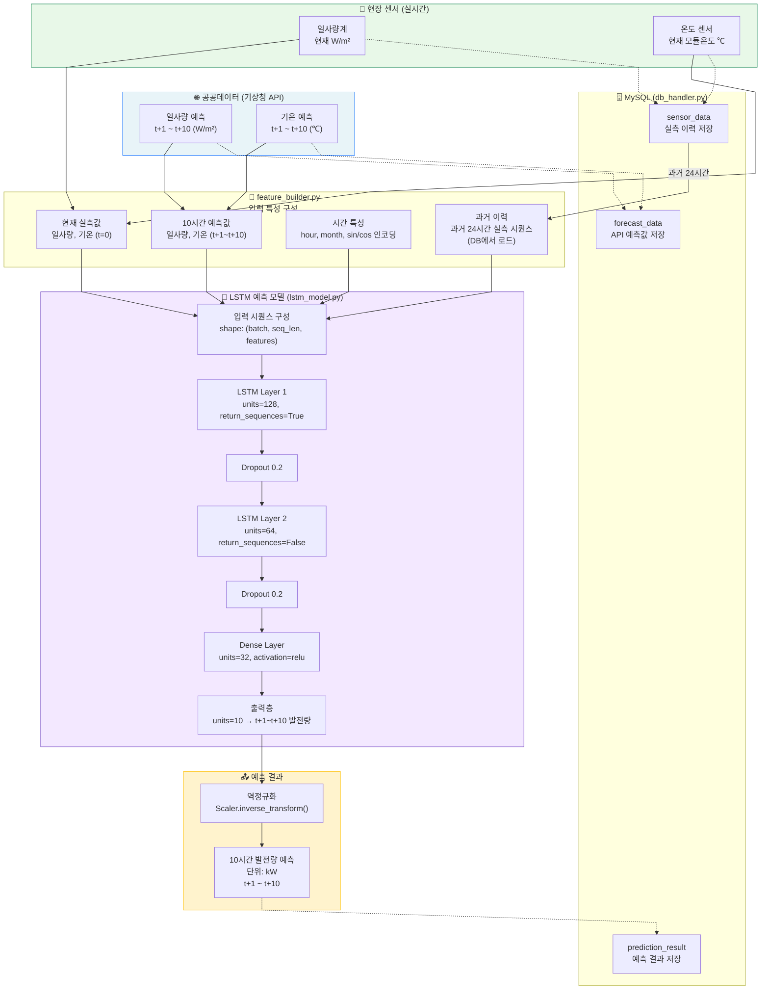
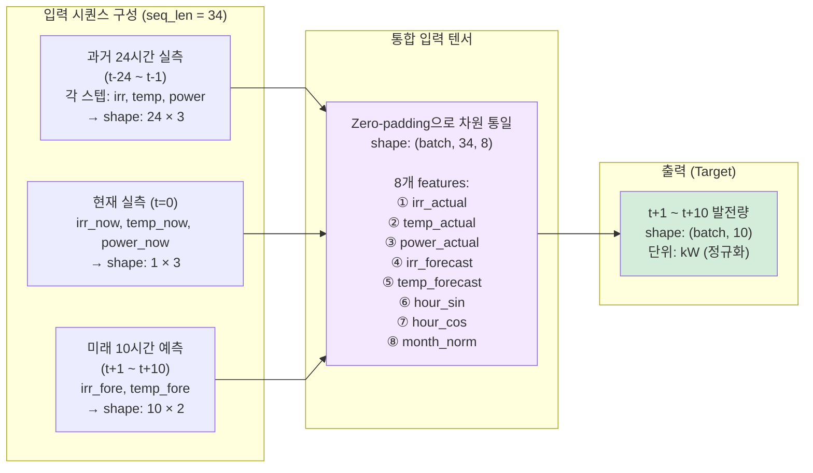
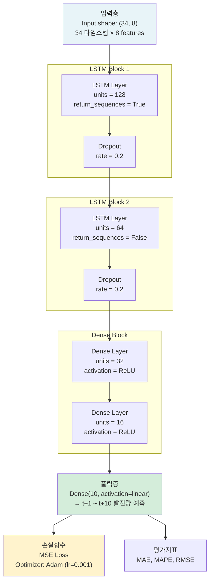
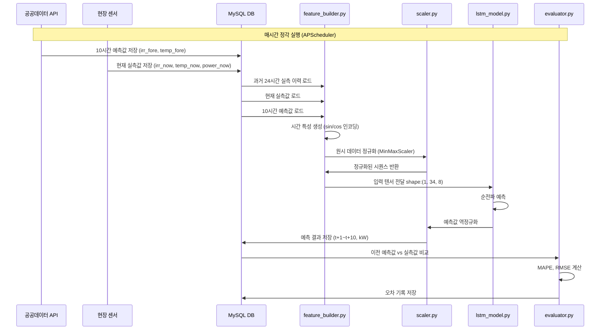
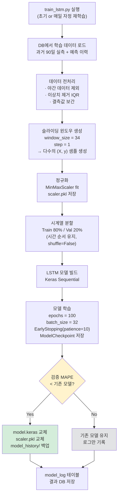
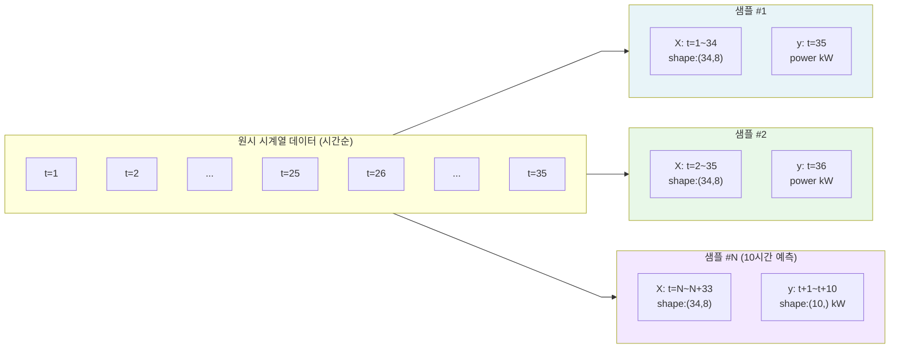
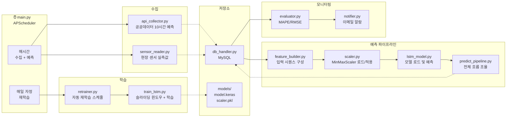

# LSTM 기반 태양광발전소 10시간 발전량 예측 시스템

> 공공데이터 기상 예측(10시간) + 현장 센서 실측값 → LSTM 모델 → 10시간 후 발전량 예측

---

## 1. 전체 시스템 블록도



---

## 2. LSTM 입력 시퀀스 구성 상세



---

## 3. LSTM 모델 아키텍처



---

## 4. 데이터 흐름 및 처리 파이프라인



---

## 5. 학습 파이프라인 (train_lstm.py)



---

## 6. 슬라이딩 윈도우 데이터셋 생성



---

## 7. 모듈 구성 및 디렉토리 구조



---

## 8. 디렉토리 구조

```
solar_lstm/
├── main.py                    # APScheduler 진입점
├── config.py                  # DB, API, 시스템 파라미터
│
├── collector/
│   ├── api_collector.py       # 공공데이터 10시간 예측 수집
│   └── sensor_reader.py       # 현장 센서 실측값 수신
│
├── db/
│   └── db_handler.py          # MySQL CRUD
│
├── pipeline/
│   ├── feature_builder.py     # 입력 시퀀스 구성 (34×8)
│   ├── scaler.py              # MinMaxScaler 로드/저장
│   ├── lstm_model.py          # LSTM 모델 정의 및 추론
│   └── predict_pipeline.py    # 매시간 예측 파이프라인
│
├── training/
│   ├── train_lstm.py          # 슬라이딩 윈도우 + 모델 학습
│   └── retrainer.py           # 자동 재학습 스케줄러
│
├── monitoring/
│   ├── evaluator.py           # MAPE, RMSE 계산
│   └── notifier.py            # 이메일 알람 (smtplib)
│
├── api/
│   └── api_server.py          # FastAPI 예측 결과 제공
│
└── models/
    ├── model.keras             # 현재 LSTM 모델
    ├── scaler.pkl              # MinMaxScaler (학습 시 fit)
    └── model_history/          # 이전 모델 백업
```

---

## 9. 주요 라이브러리

| 모듈 | 라이브러리 | 용도 |
|------|-----------|------|
| lstm_model.py | `tensorflow`, `keras` | LSTM 모델 정의·추론 |
| train_lstm.py | `tensorflow`, `keras`, `numpy` | 모델 학습 |
| feature_builder.py | `pandas`, `numpy` | 시퀀스 구성·시간 인코딩 |
| scaler.py | `sklearn.preprocessing` | MinMaxScaler |
| api_collector.py | `requests` | 공공데이터 API 호출 |
| sensor_reader.py | `paho-mqtt` | MQTT 센서 수신 |
| db_handler.py | `pymysql`, `sqlalchemy` | MySQL 연동 |
| evaluator.py | `sklearn.metrics`, `numpy` | 오차 평가 |
| notifier.py | `smtplib`, `email` | 이메일 알람 |
| main.py | `apscheduler` | 스케줄 자동화 |
| api_server.py | `fastapi`, `uvicorn` | REST API 서비스 |
