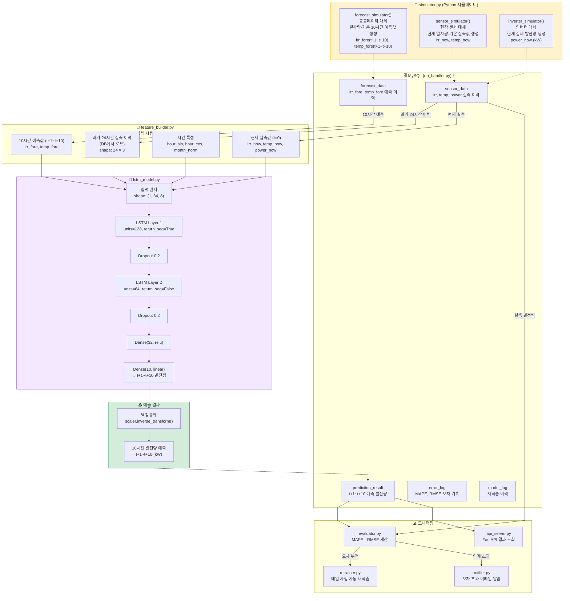
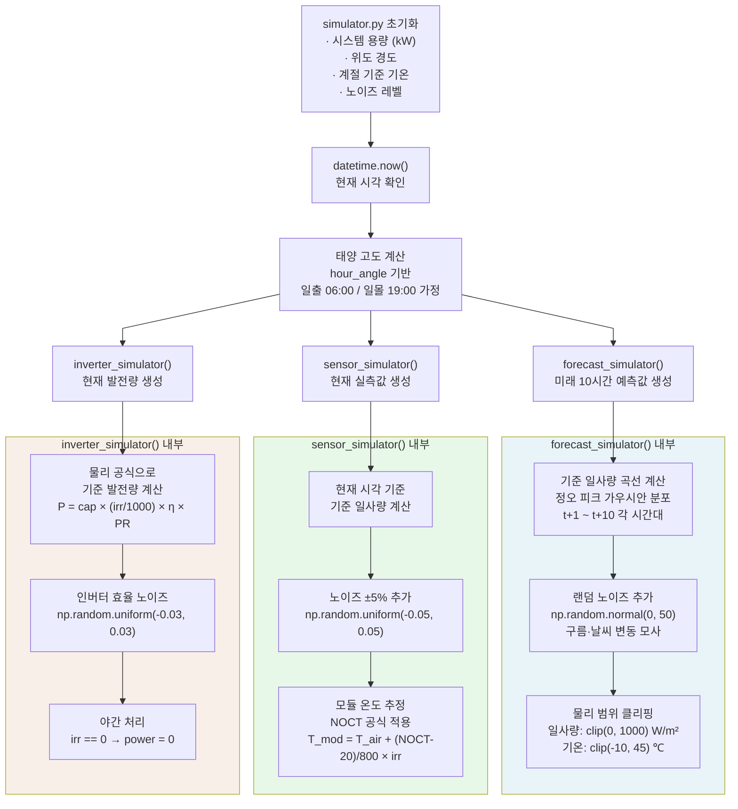
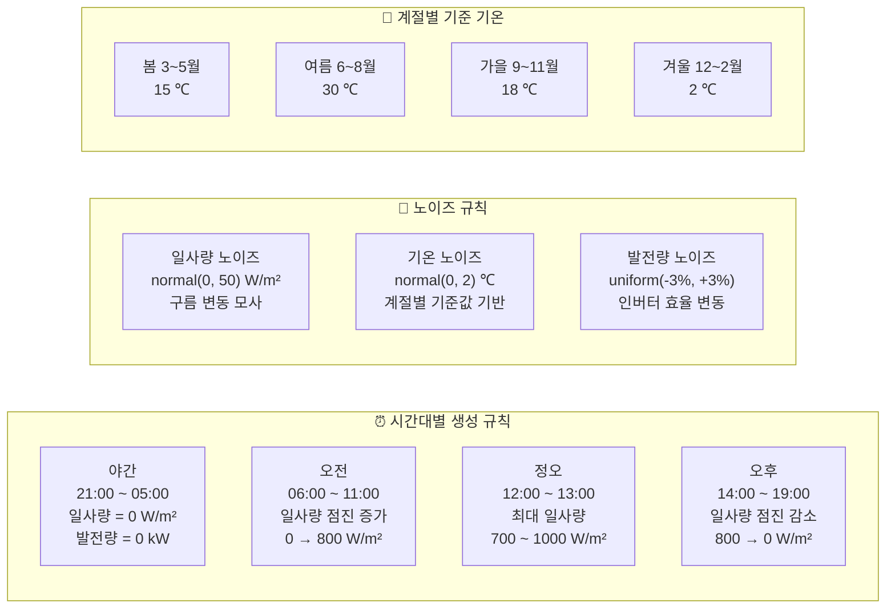
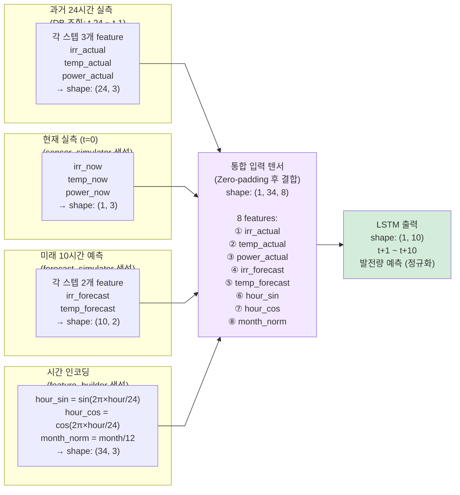
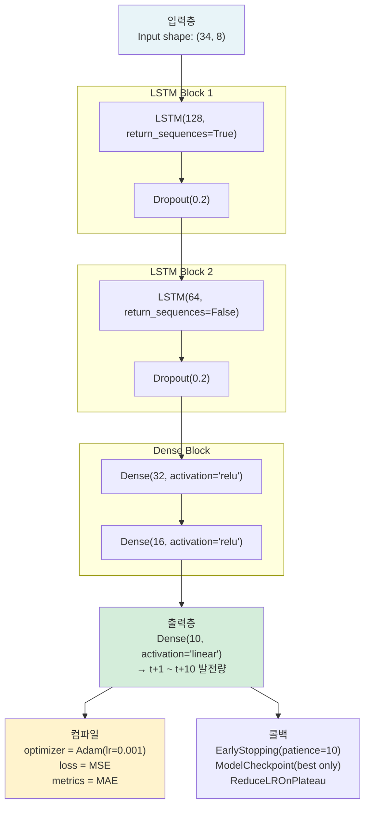
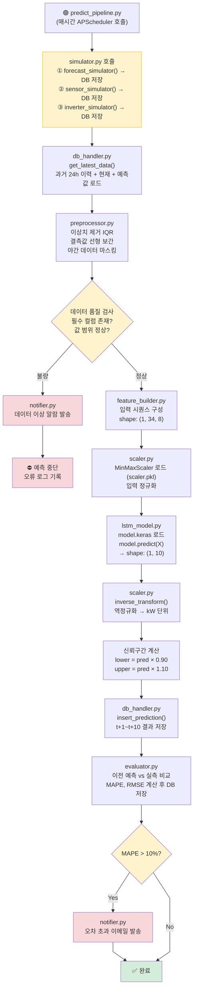
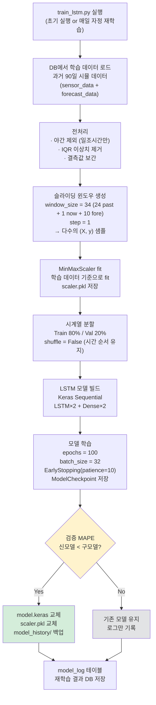
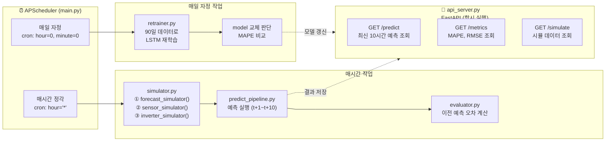
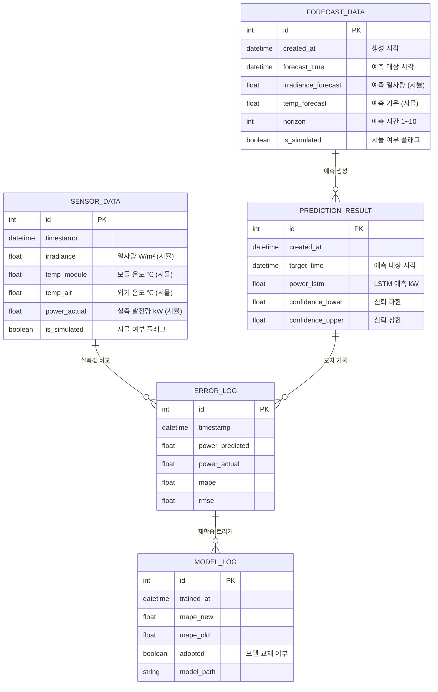

# LSTM 기반 태양광발전소 10시간 발전량 예측 시스템 (시뮬레이션 버전)

> 📌 **공공데이터 API 및 현장 센서는 Python 시뮬레이터로 대체**
> `simulator.py` 하나만 실제 연동 코드로 교체하면 실 운용 전환 가능

---

## 1. 전체 시스템 블록도



---

## 2. 시뮬레이터 상세 설계 (simulator.py)



---

## 3. 시뮬레이터 데이터 생성 규칙



---

## 4. LSTM 입력 시퀀스 구성



---

## 5. LSTM 모델 아키텍처



---

## 6. 예측 실행 파이프라인 (predict_pipeline.py)



---

## 7. 학습 파이프라인 (train_lstm.py)



---

## 8. 전체 자동화 스케줄 (main.py)



---

## 9. 데이터베이스 스키마 (ERD)



---

## 10. 프로젝트 디렉토리 구조

```
solar_lstm_sim/
├── main.py                    # APScheduler 진입점
├── config.py                  # DB, 시스템 용량, LSTM 하이퍼파라미터
│
├── simulator/
│   └── simulator.py           # ⭐ 랜덤 시뮬레이터
│                              #    (추후 API + MQTT로 교체)
│
├── db/
│   └── db_handler.py          # MySQL CRUD (pymysql)
│
├── pipeline/
│   ├── preprocessor.py        # 이상치 제거, 보간
│   ├── feature_builder.py     # 입력 시퀀스 구성 (34×8)
│   ├── scaler.py              # MinMaxScaler 로드/저장
│   ├── lstm_model.py          # LSTM 모델 정의 및 추론
│   └── predict_pipeline.py    # 매시간 예측 파이프라인
│
├── training/
│   ├── train_lstm.py          # 슬라이딩 윈도우 + 모델 학습
│   └── retrainer.py           # 자동 재학습 스케줄러
│
├── monitoring/
│   ├── evaluator.py           # MAPE, RMSE 계산
│   └── notifier.py            # 이메일 알람 (smtplib)
│
├── api/
│   └── api_server.py          # FastAPI 예측 결과 제공
│
└── models/
    ├── model.keras             # 현재 LSTM 모델
    ├── scaler.pkl              # MinMaxScaler
    └── model_history/          # 이전 모델 백업
```

> ⭐ `simulator/simulator.py` 하나만 아래 두 파일로 교체하면 실 운용 전환 완료
> - `collector/api_collector.py` → 공공데이터 API 호출
> - `collector/sensor_reader.py` → MQTT 현장 센서 수신

---

## 11. 주요 라이브러리

| 모듈 | 라이브러리 | 용도 |
|------|-----------|------|
| simulator.py | `numpy`, `datetime` | 랜덤 시뮬 데이터 생성 |
| db_handler.py | `pymysql`, `sqlalchemy` | MySQL 연동 |
| preprocessor.py | `pandas`, `numpy`, `scipy` | 전처리 |
| feature_builder.py | `pandas`, `numpy` | 시퀀스 구성·시간 인코딩 |
| scaler.py | `sklearn.preprocessing` | MinMaxScaler |
| lstm_model.py | `tensorflow`, `keras` | LSTM 모델 정의·추론 |
| train_lstm.py | `tensorflow`, `keras`, `numpy` | 모델 학습 |
| retrainer.py | `apscheduler` | 자동 재학습 스케줄 |
| evaluator.py | `sklearn.metrics`, `numpy` | 오차 평가 |
| notifier.py | `smtplib`, `email` | 이메일 알람 |
| api_server.py | `fastapi`, `uvicorn` | REST API 서비스 |
| main.py | `apscheduler` | 전체 스케줄 자동화 |
